#    Tecnológico Nacional de México
#   Instituto Tecnológico de Tijuana
#        Subdirección Académica

# Departamento de Sistemas y Computación
# Ingeniería en Sistemas Computacionales
# Lenguajes de interfaz 

# Practica Bloque: 2 📝
# Objetivo: Resumen capitulo 1 y capitulo 2.


# 📝 Madueño Morales Arturo Ernesto - 17210592
   

# Profesor: MC. René Solis Reyes
# Semestre sep - ene 2020


<a href="http://es.cooltext.com" target="_top"></a>


**1.1.1. Características generales de la arquitectura ARM**

En este primer subtema conocemos ARM que es una arquitectura RISC de 32 bits, salvo la versión del core ARMv8- A que es mixta 32/64 bits. 

**Registros** En los registros la arquitectura ARMv6 presenta un conjunto de 17 registros de 32 bits cada uno. Como se puede apreciar en la imagen.

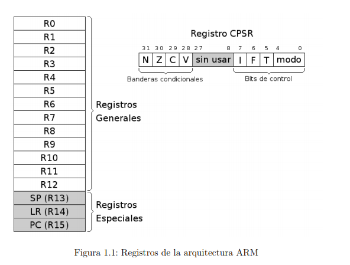

**Registros Generales.** Su función es el almacenamiento temporal de datos. Son los 13 registros que van R0 hasta R12.

**Registros Especiales.** Son los últimos 3 registros principales: R13, R14 y R15. Como son de propósito especial, tienen nombres alternativos.

**Registro CPSR.** Almacena las banderas condicionales y los bits de control. Los bits de control definen la habilitación de interrupciones normales (I), interrupciones rápidas (F), modo Thumb 1 (T) y el modo de operación de la CPU.

**Esquema de almacenamiento** Cuando escribimos un dato en una posición de memoria, dependiendo de sies byte, half word o word,... se ubica en memoria según la imagen que vemos a continuacion. La dirección de un dato es la de su byte menos significativo. La memoria siempre sereferencia a nivel de byte, es decir si decimos la posición N nos estamos refiriendo al byte N-ésimo, aunque se escriba media palabra, una palabra.

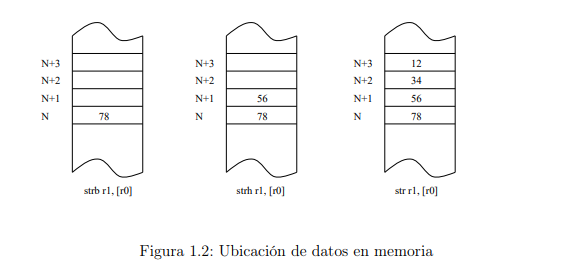

**1.1.2. El lenguaje ensamblador**

El ensamblador presenta una serie de ventajas e inconvenientes con respecto a otros lenguajes de más alto nivel. Al ser un lenguaje de bajo nivel, presenta como
principal característica la flexibilidad y la posibilidad de acceso directo a nivel de registro. En contrapartida, programar en ensamblador es laborioso puesto que los
programas contienen un número elevado de líneas y la corrección y depuración de éstos se hace difícil.

**1.1.3. El entorno**
Los pasos habituales para hacer un programa (en cualquier lenguaje) son los siguientes: lo primero es escribir el programa en el lenguaje fuente mediante un editor de programas. El resultado es un fichero en un lenguaje que puede entender el usuario, pero no la máquina. Para traducirlo a lenguaje máquina hay que utilizar
un programa traductor. Éste genera un fichero con la traducción de dicho programa, pero todavía no es un programa ejecutable.

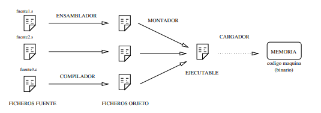

**1.1.4. Configuración del entorno para realizar las prácticas en casa**

En este subtema explica lo que vimos en clase, como instalar QEMU y raspberryOS.

**1.1.5. Aspecto de un programa en ensamblador**

En el listado 1.1 se muestra el código de la primera práctica que probaremos. En el código hay una serie de elementos que aparecerán en todos los programas y que estudiaremos a continuación.

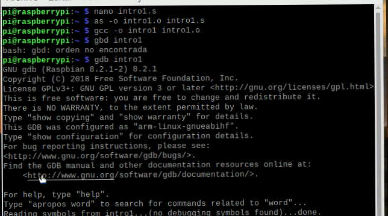

La principal característica de un módulo fuente en ensamblador es que existe una clara separación entre las instrucciones y los datos. La estructura más general
de un módulo fuente es:

**Sección de datos** Viene identificada por la directiva .data. En esta zona se definen todas las variables que utiliza el programa con el objeto de reservar memoria para contener los valores asignados.

**Sección de código.** Se indica con la directiva .text, y sólo puede contener código o datos no modificables. Como todas las instrucciones son de 32 bits no hay que tener especial cuidado en que estén alineadas.

**Directivas**

Las directivas son expresiones que aparecen en el módulo fuente e indican al
compilador que realice determinadas tareas en el proceso de compilación. Son fácilmente distinguibles de las instrucciones porque siempre comienzan con un punto.

**Directivas de asignación:** Se utilizan para dar valores a las constantes o reservar posiciones de memoria para las variables.

```
a1 : .byte 1 /* tipo byte, inicializada a 1 */
var2 : .byte ’A ’ /* tipo byte, al caracter ’A’ */
var3 : .hword 25000 /* tipo hword (16 bits ) a 25000 */
var4 : .word 0x12345678 /* tipo word de 32 bits */
b1 : .ascii " hola " /* define cadena normal */
b2 : .asciz " ciao " /* define cadena acabada en NUL */
dat1 : .zero 300 /* 300 bytes de valor cero */
dat2 : .space 200, 4 /* 200 bytes de valor 4 */
```

**Directivas de control:** .text y .data sirven para delimitar las distintas secciones de nuestro módulo. .align alineamiento es para alinear el siguiente dato, rellenando con ceros, de tal forma que comience en una dirección múltiplos del número que especifiquemos en alineamiento, normalmente potencia de 2.
```
a1 : .byte 25 /* definimos un byte con el valor 25 */
.align /* directiva que rellena con 3 bytes */
a2 : .word 4 /* variable alineada a tama ño palabra */
```

**Directivas de operando:** Se aplican a los datos en tiempo de compilación. En general, incluyen las operaciones lógicas &, |, ∼, aritméticas +, -, *, /, % y de
desplazamiento <, >, <<, >>.
```
.equ pies, 9 /* definimos a 9 la constante pies */
.equ yardas, pies / 3 /* calculamos las yardas = 3 */
.equ pulgadas, pies * 12 /* calculamos pulgadas = 108 */
```

**Directivas de Macros:** Una .macro es un conjunto de sentencias en ensamblador que pueden aparecer varias veces repetidas en un programa con algunas modificaciones.
```
.macro CuadM1 input, aux, output
mul aux, input, input
add output, aux, # 1
.endm
```

**1.1.6. Ensamblar y linkar un programa**
Este tema ya lo vimos en clase, explica como compilar el progama .s y crear el ejecutador.

**intro 1**

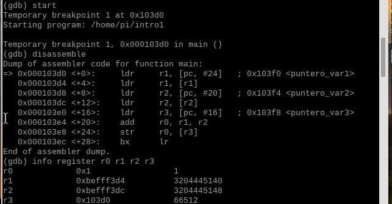
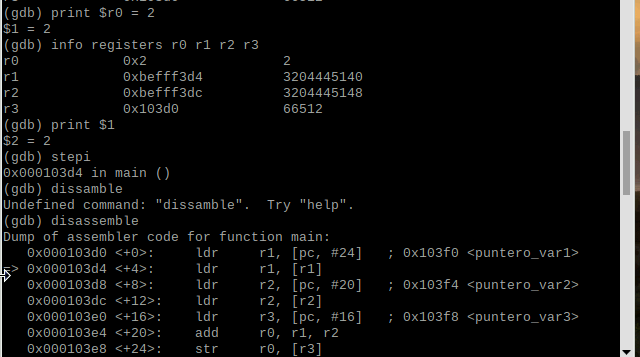
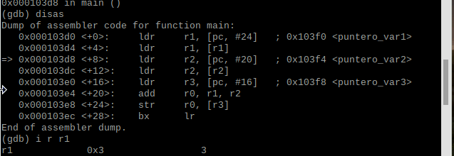
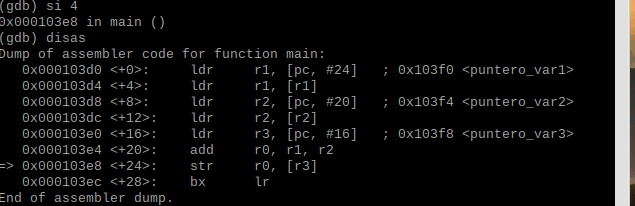
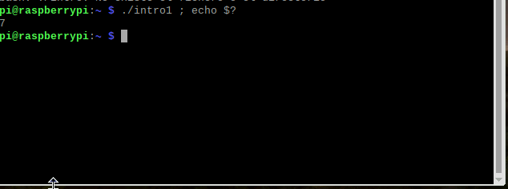


**intro 2**

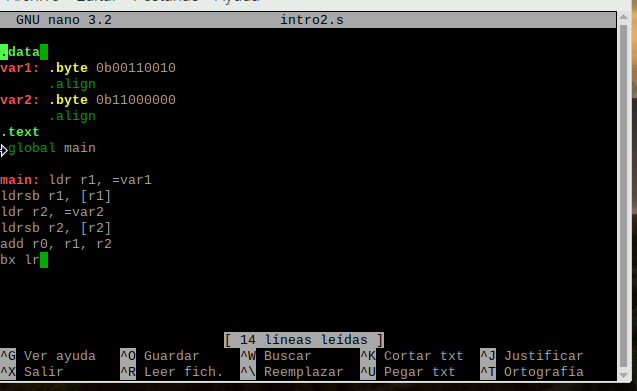

**intro 3**

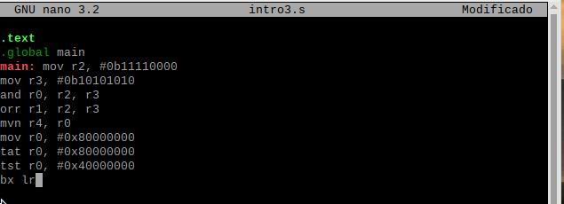

**1.2. Enunciados de la práctica**

**1.2.4. Rotaciones y desplazamientos** En este apartado veremos el funcionamiento de las instrucciones de desplamiento y rotación. Las instrucciones de desplazamiento pueden ser lógicas o aritméticas. Los desplazamientos lógicos desplazan los bit del registro fuente introduciendo ceros. 

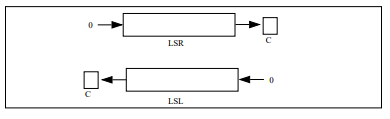
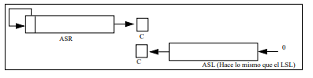

**intro 4**

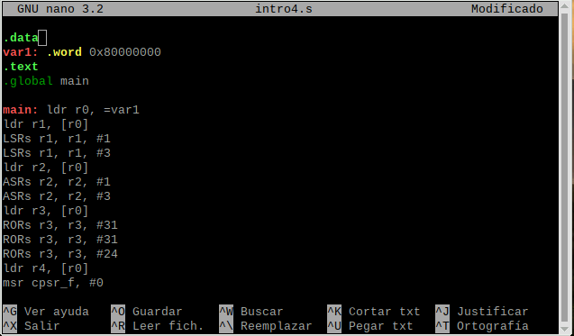
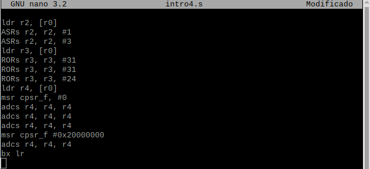

**intro 5**

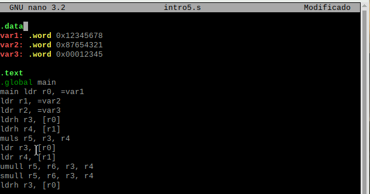
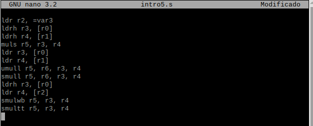


<a href="http://es.cooltext.com" target="_top"></a>

**2.1.1. Modos de direccionamiento del ARM** En la arquitectura ARM los accesos a memoria se hacen mediante instrucciones específicas ldr y str. El resto de instrucciones toman operandos desde registros o valores inmediatos, sin excepciones. En este caso la arquitectura nos fuerza a que trabajemos de un modo determinado: primero cargamos los registros desde memoria, luego procesamos el valor de estos registros con el amplio abanico de instrucciones del ARM, para finalmente volcar los resultados desde registros a memoria. 

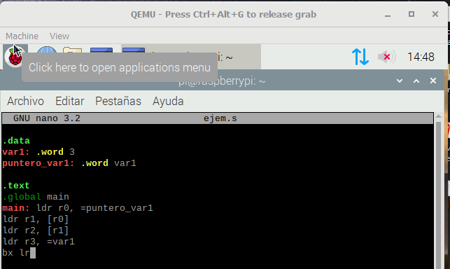


**Direccionamiento inmediato.** El operando fuente es una constante, formando parte de la instrucción.
```
mov r0, # 1
add r2, r3, #4

```

**Direccionamiento inmediato con desplazamiento o rotación.** Es una variante del anterior en la cual se permiten operaciones intermedias sobre los registros.
```
mov r1, r2, LSL #1 /* r1 <- (r2*2) */
mov r1, r2, LSL #2 /* r1 <- (r2*4) */
mov r1, r3, ASR #3 /* r1 <- (r3/8) */
```

**Direccionamiento a memoria, sin actualizar registro puntero.** Es la forma más sencilla y admite 4 variantes. Después del acceso a memoria ningún registro implicado en el cálculo de la dirección se modifica.
```
mov r2, # 1 /* r2 <- 1 */
str r2, [ r1, #+ 12 ] /* *( r1 + 12) <- r2 */
```

**Direccionamiento a memoria, actualizando registro puntero.** En este modo de direccionamiento, el registro que genera la dirección se actualiza con la propia dirección. De esta forma podemos recorrer un array con un sólo registro sin necesidad de hacer el incremento del puntero en una instrucción aparte.
```
mov r2, # 0 /* r2 <- 0 */
str r2, [ r1 ] , #+ 4 /* a[0] <- r2 */
str r2, [ r1 ] , #+ 4 /* a[1] <- r2 */
str r2, [ r1 ] , #+ 4 /* a[2] <- r2 */
```

**2.1.2. Tipos de datos** Tipos de datos básicos. En la siguiente tabla se recogen los diferentes tipos de datos básicos que podrán aparecer en los ejemplos, así como su
tamaño y rango de representación.
|      ARM      |                           Tipo en C                           |     Bits    |                                       Rango                                       |
|:-------------:|:-------------------------------------------------------------:|:-----------:|:---------------------------------------------------------------------------------:|
|     .byte     |                  unsigned char (signed) char                  |     8 8     |                                 0 a 255 -128 a 127                                |
| .hword .short |             unsigned short int (signed) short int             |    16 16    |                             0 a 65.535 -32.768 a 32767                            |
|   .word .int  | unsigned int (signed) int unsigned long int (signed) long int | 32 32 32 32 | .0 a 42949672960 -2147483648 a 2147483647 0 a 4294967296 -2147483648 a 2147483647 |
|     .quad     |             unsigned long long (signed) long long             |    64 64    |                              0 a 2^64 -2^63 a 2^63-1                              |

**Punteros.** Un puntero siempre ocupa 32 bits y contiene una dirección de memoria. En ensamblador no tienen tanta utilidad como en C, ya que disponemos de registros de sobra y es más costoso acceder a las variables a través de los punteros que directamente. 

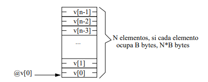

**Vectores.** Todos los elementos de un vector se almacenan en un único bloque de memoria a partir de una dirección determinada. Los diferentes elementos se almacenan en posiciones consecutivas, de manera que el elemento i está entre los i-1 e i+1.

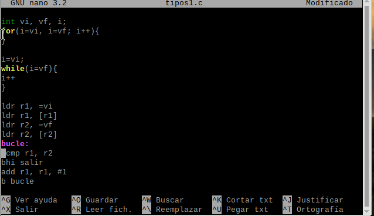

**Matrices bidimensionales.** Una matriz bidimensional de N×M elementos se almacena en un único bloque de memoria. Interpretaremos una matriz de N×M como una matriz con N filas de M elementos cada una. Si cada elemento de la matriz ocupa B bytes, la matriz ocupará un bloque de M ×N ×B bytes.

**2.1.3. Instrucciones de salto** Las instrucciones de salto pueden producir saltos incondicionales (b y bx) o saltos condicionales. Cuando saltamos a una etiqueta empleamos b, mientras que si queremos saltar a un registro lo hacemos con bx. La variante de registro bx la solemos usar como instrucción de retorno de subrutina, raramente tiene otros usos.
En los saltos condicionales añadimos dos o tres letras a la (b/bx), mediante las cuales condicionamos si se salta o no dependiendo del estado de los flags.

*Por ejemplo, la instrucción beq destino_salto producirá un salto a la instrucción indicada por la etiqueta destino_salto si y sólo si el bit de estado cero está
*activo (Z=1), y en caso contrario (Z=0) no interrumpirá el flujo secuencial de instrucciones.
```
main : mov r1, # 1
mov r2, # 2
bl subrut
mov r4, # 4 /* Siguiente instrucci ón */
...
subrut : mov r3, #3
bx lr
```

*Si seguimos el flujo del programa primero cargamos r1 a 1, luego r2 a 2 y lo siguiente que hay es una llamada a subrutina. En dicha llamada el procesador carga en lr la *dirección de la siguiente instrucción “mov r4, #4” y salta a la etiqueta subrut. Se ejecuta el “mov r3, #3” de la subrutina y después “bx lr” que vendría a ser la instrucción *de retorno. Es decir, salimos de la subrutina retomando el flujo del programa principal, ejecutando “mov r4, #4”.
```
main : mov r1, # 1
mov r2, # 2
bl nivel1
mov r5, # 5 /* Siguiente instrucci ón */
...
nivel1 : push { lr }
mov r3, # 3
bl nivel2
pop { lr }
bx lr
nivel2 : mov r4, #4
bx lr
```

**2.1.4. Estructuras de control de alto nivel** En este punto veremos cómo se traducen a ensamblador las estructuras de control de alto nivel que definen un bucle (for, while, . . . ), así como las condicionales (if-else). Las estructuras for y while se pueden ejecutar un mínimo de 0 iteraciones. La traducción de las estructuras for y while.

**listado 2.1**

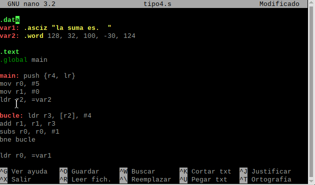

**2.1.5. Compilación a ensamblador**
Para acabar la teoría veamos cómo trabaja un compilador de C real. Normalmente los compiladores crean código compilado (archivos .o) en un único paso. En el caso de gcc este proceso se hace en dos fases: en una primera se pasa de C a ensamblador, y en una segunda de ensambladador a código compilado.

**2.2. Enunciados de la práctica**
**2.2.1. Suma de elementos de un vector** En este primer apartado, estudiaremos un bucle que calcula la suma de todos los elementos de un vector. El vector se denomina vector y tiene 5 elementos de tipo int (entero de 32 bits).

```
# include < stdio .h >
void main ( void ){
int i , suma ;
int vector [5]= {128 , 32 , 100 , -30 , 124};
for ( suma = i = 0; i <5; i ++ ){
suma += vector [i ];
}
printf (" La suma es %d \n" , suma );
}
```

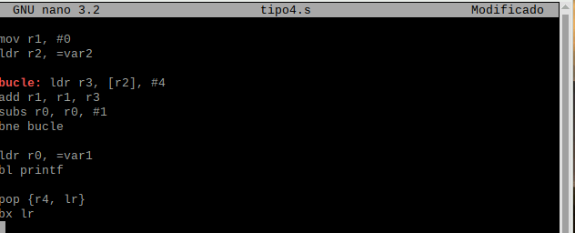

